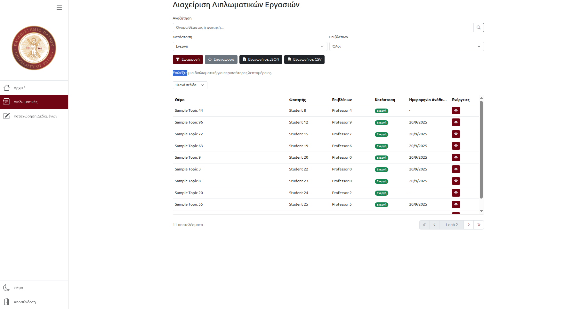

# Theseus - Thesis Management System

Theseus is a web-based platform designed to streamline the management of theses for academic institutions. It provides tools for faculty members, students, and administrators to manage thesis topics, assignments, progress tracking, and statistics efficiently.

---

## Features

- **Thesis Management**: Create, assign, and track thesis topics.
- **Faculty Tools**: View and manage invitations to committees, track thesis statistics, and analyze performance.
- **Student Tools**: Browse available thesis topics and track progress.
- **Statistics and Insights**: Visualize data such as average completion times, grades, and thesis distributions.
- **Role-Based Access Control**: Secure access for students, faculty, and administrators.



---

## Getting Started

### Prerequisites

Ensure you have the following installed:

- [Node.js](https://nodejs.org/)
- [npm](https://www.npmjs.com/)
- [Docker](https://www.docker.com/) or [Podman](https://podman.io/)
- [Docker Compose](https://docs.docker.com/compose/) or [Podman Compose](https://github.com/containers/podman-compose)

---

### Installation

1. **Clone the repository**:

   ```bash
      git clone https://github.com/yourusername/ceid-web-project.git
   ```

2. **Run the containers**:

   ```bash
      cd ceid-web-project
      docker compose up theseus-nginx
   ```

The entire system should now be running at <http://localhost:8080> and <https://localhost:8443>.

Of course, you can change ports and other environment variables in [compose.yaml](./compose.yaml).

## Development

### Project Structure


### Running the server

```bash
docker compose up theseus-dev
```

The server should now be running at <http://localhost:3000>.
